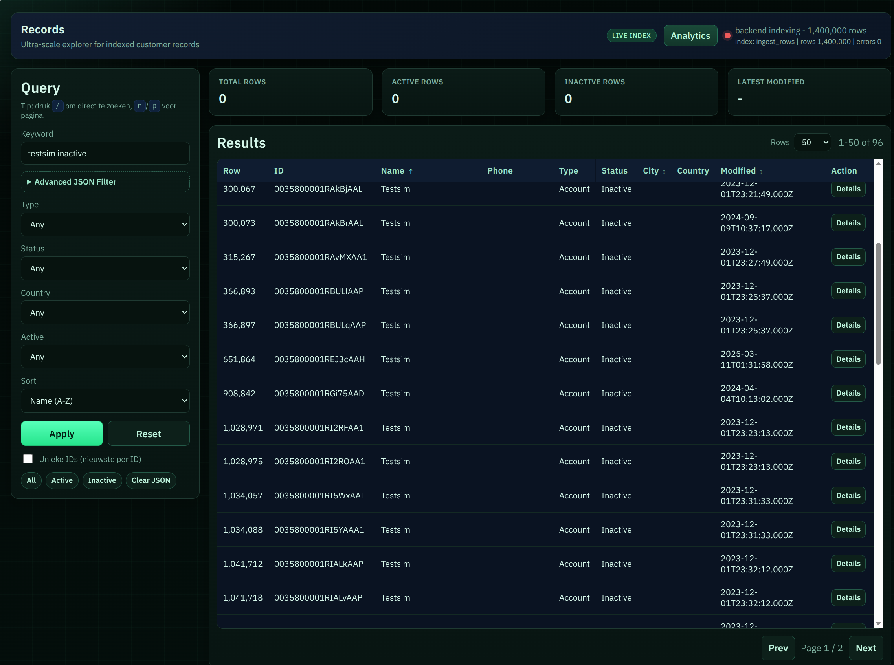

# Totally-not-odido-parser-v2


Local viewer for large `dataset.txt` files.

Run one command, the web app comes online immediately, and data is ingested/indexed in the background.

## What matters most

> 🚨 **Vibe code alert:** this fork is now PostgreSQL + multi-arch Docker focused; if you are still using `dataset.sqlite` mode, make sure to use the new flags in `cmd/server/main.go`.
> 
> - `-db-host`, `-db-port`, `-db-user`, `-db-password`, `-db-name`
> - old `-db dataset.sqlite` mode is legacy

- The web interface is available right away at `http://localhost:8080`.
- You can already search and view records during the **first ingest**.
- Results become more complete and faster as ingest/indexing progresses.
- If the process stops, it resumes automatically from the last committed batch.

## Quick start

```bash
go run ./cmd/server -dataset dataset.txt -db dataset.sqlite
```

Then open:

- `http://localhost:8080/` (search UI)
- `http://localhost:8080/analytics` (analytics UI)

## Docker

Build image:

```bash
docker build -t totally-not-odido-parser-v2:latest .
```

Multi-arch build (AMD64 + ARM64) with Buildx:

```bash
docker buildx build --platform linux/amd64,linux/arm64 -t totally-not-odido-parser-v2:latest .
```

Run container (dataset/db from host folder):

```bash
docker run --rm -p 8080:8080 -v "$(pwd):/data" totally-not-odido-parser-v2:latest
```

## What the app does

- Reads lines from `dataset.txt`.
- Stores them locally in `dataset.sqlite`.
- Builds indexes for fast search/filtering.
- Shows indexing progress in the UI (top-right) and periodically in CLI logs.

## New in this fork (short)

- Web UI is available immediately, even during the first ingest.
- Records are searchable during ingest; no need to wait for 100%.
- Resume after restart: indexing continues from the last committed batch.
- Faster default ingest settings (fast-index always on, batch size `50000`).
- Better keyword search across more fields (`fts-broad` enabled by default).
- Improved UI with index status, communication/notes views, and analytics.

## First startup

If `dataset.sqlite` does not exist yet:

- the app creates the database automatically;
- ingest/indexing starts automatically;
- the web UI remains usable during this process.

## Next startups

- If the database is valid, everything is ready immediately.
- If the dataset changed, rebuild starts automatically.

## Default behavior

- Fast-index is always enabled.
- Default commit batch is `50000`.
- JSON fields are indexed by default.

## Useful options

```bash
go run ./cmd/server -addr :8080 -dataset dataset.txt -db dataset.sqlite
```

- `-addr`: listen address/port (default `:8080`)
- `-dataset`: dataset path (default `dataset.txt`)
- `-db`: sqlite path (default `dataset.sqlite`)
- `--fts-broad`: broader keyword index (default `true`)

## Common API endpoints

- `GET /api/health`
- `GET /api/index/status`
- `GET /api/stats`
- `GET /api/records?...`
- `GET /api/analytics/distribution?field=email_domain&limit=25&not_empty=true`

## Troubleshooting

Check port:

```bash
ss -ltnp | rg ':8080'
```

Health check:

```bash
curl -sS http://localhost:8080/api/health
```

Index status:

```bash
curl -sS http://localhost:8080/api/index/status
```

## Note

For speed, fast-index uses aggressive SQLite settings. That is fine for rebuilds you can rerun at any time.

## Credits

Based on the original project: https://github.com/stuncs69/totally-not-odido-parser
